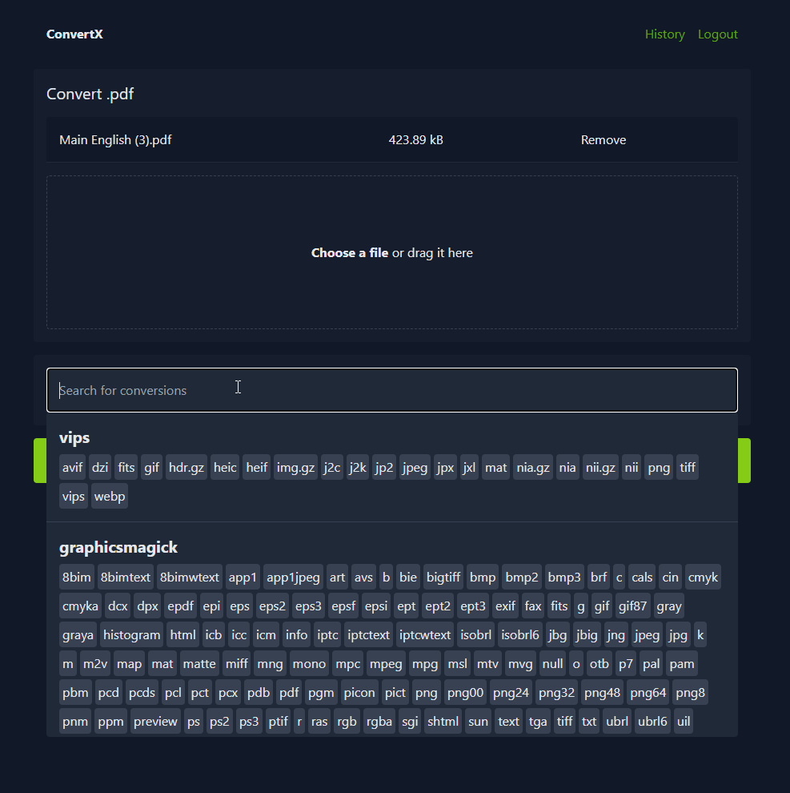

# ConvertX

[](https://github.com/C4illin/ConvertX/actions/workflows/docker-publish.yml)
[](https://github.com/C4illin/ConvertX/pkgs/container/ConvertX)
[](https://hub.docker.com/r/c4illin/convertx)
[](https://github.com/C4illin/ConvertX/pkgs/container/convertx)


<a href="https://trendshift.io/repositories/13818" target="_blank"></a>

<!--  -->

A self-hosted online file converter. Supports over a thousand different formats. Written with TypeScript, Bun and Elysia.

## Features

- Convert files to different formats
- Process multiple files at once
- Password protection
- Multiple accounts

## Converters supported

| Converter                                                       | Use case         | Converts from | Converts to |
| --------------------------------------------------------------- | ---------------- | ------------- | ----------- |
| [Inkscape](https://inkscape.org/)                               | Vector images    | 7             | 17          |
| [libjxl](https://github.com/libjxl/libjxl)                      | JPEG XL          | 11            | 11          |
| [resvg](https://github.com/RazrFalcon/resvg)                    | SVG              | 1             | 1           |
| [Vips](https://github.com/libvips/libvips)                      | Images           | 45            | 23          |
| [libheif](https://github.com/strukturag/libheif)                | HEIF             | 2             | 4           |
| [XeLaTeX](https://tug.org/xetex/)                               | LaTeX            | 1             | 1           |
| [Calibre](https://calibre-ebook.com/)                           | E-books          | 26            | 19          |
| [LibreOffice](https://www.libreoffice.org/)                     | Documents        | 41            | 22          |
| [Dasel](https://github.com/TomWright/dasel)                     | Data Files       | 5             | 4           |
| [Pandoc](https://pandoc.org/)                                   | Documents        | 43            | 65          |
| [msgconvert](https://github.com/mvz/email-outlook-message-perl) | Outlook          | 1             | 1           |
| [dvisvgm](https://dvisvgm.de/)                                  | Vector images    | 4             | 2           |
| [ImageMagick](https://imagemagick.org/)                         | Images           | 245           | 183         |
| [GraphicsMagick](http://www.graphicsmagick.org/)                | Images           | 167           | 130         |
| [Assimp](https://github.com/assimp/assimp)                      | 3D Assets        | 77            | 23          |
| [FFmpeg](https://ffmpeg.org/)                                   | Video            | ~472          | ~199        |
| [Potrace](https://potrace.sourceforge.net/)                     | Raster to vector | 4             | 11          |
| [VTracer](https://github.com/visioncortex/vtracer)              | Raster to vector | 8             | 1           |

<!-- many ffmpeg fileformats are duplicates -->

Any missing converter? Open an issue or pull request!

## Deployment

> [!WARNING]
> If you can't login, make sure you are accessing the service over localhost or https otherwise set HTTP_ALLOWED=true

```yml
# docker-compose.yml
services:
  convertx:
    image: ghcr.io/c4illin/convertx
    container_name: convertx
    restart: unless-stopped
    ports:
      - "3000:3000"
    environment:
      - JWT_SECRET=aLongAndSecretStringUsedToSignTheJSONWebToken1234 # will use randomUUID() if unset
      # - HTTP_ALLOWED=true # uncomment this if accessing it over a non-https connection
    volumes:
      - ./data:/app/data
```

or

```bash
docker run -p 3000:3000 -v ./data:/app/data ghcr.io/c4illin/convertx
```

Then visit `http://localhost:3000` in your browser and create your account. Don't leave it unconfigured and open, as anyone can register the first account.

If you get unable to open database file run `chown -R $USER:$USER path` on the path you choose.

### Environment variables

All are optional, JWT_SECRET is recommended to be set.

| Name                         | Default                                            | Description                                                                                                               |
| ---------------------------- | -------------------------------------------------- | ------------------------------------------------------------------------------------------------------------------------- |
| JWT_SECRET                   | when unset it will use the value from randomUUID() | A long and secret string used to sign the JSON Web Token                                                                  |
| ACCOUNT_REGISTRATION         | false                                              | Allow users to register accounts                                                                                          |
| HTTP_ALLOWED                 | false                                              | Allow HTTP connections, only set this to true locally                                                                     |
| ALLOW_UNAUTHENTICATED        | false                                              | Allow unauthenticated users to use the service, only set this to true locally                                             |
| AUTO_DELETE_EVERY_N_HOURS    | 24                                                 | Checks every n hours for files older then n hours and deletes them, set to 0 to disable                                   |
| WEBROOT                      |                                                    | The address to the root path setting this to "/convert" will serve the website on "example.com/convert/"                  |
| FFMPEG_ARGS                  |                                                    | Arguments to pass to ffmpeg, e.g. `-preset veryfast`                                                                      |
| HIDE_HISTORY                 | false                                              | Hide the history page                                                                                                     |
| LANGUAGE                     | en                                                 | Language to format date strings in, specified as a [BCP 47 language tag](https://en.wikipedia.org/wiki/IETF_language_tag) |
| UNAUTHENTICATED_USER_SHARING | false                                              | Shares conversion history between all unauthenticated users                                                               |
| MAX_CONVERT_PROCESS          | 0                                                  | Maximum number of concurrent conversion processes allowed. Set to 0 for unlimited.                                        |

### Docker images

There is a `:latest` tag that is updated with every release and a `:main` tag that is updated with every push to the main branch. `:latest` is recommended for normal use.

The image is available on [GitHub Container Registry](https://github.com/C4illin/ConvertX/pkgs/container/ConvertX) and [Docker Hub](https://hub.docker.com/r/c4illin/convertx).

| Image                                  | What it is                       |
| -------------------------------------- | -------------------------------- |
| `image: ghcr.io/c4illin/convertx`      | The latest release on ghcr       |
| `image: ghcr.io/c4illin/convertx:main` | The latest commit on ghcr        |
| `image: c4illin/convertx`              | The latest release on docker hub |
| `image: c4illin/convertx:main`         | The latest commit on docker hub  |


<!-- Dockerhub was introduced in 0.9.0 and older releases -->

### Tutorial

> [!NOTE]
> These are written by other people, and may be outdated, incorrect or wrong.

Tutorial in french: <https://belginux.com/installer-convertx-avec-docker/>

Tutorial in chinese: <https://xzllll.com/24092901/>

## Screenshots



## Development

0. Install [Bun](https://bun.sh/) and Git
1. Clone the repository
2. `bun install`
3. `bun run dev`

Pull requests are welcome! See open issues for the list of todos. The ones tagged with "converter request" are quite easy. Help with docs and cleaning up in issues are also very welcome!

Use [conventional commits](https://www.conventionalcommits.org/en/v1.0.0/#summary) for commit messages.

## Contributors

<a href="https://github.com/C4illin/ConvertX/graphs/contributors">
  
</a>

## Star History

<a href="https://github.com/C4illin/ConvertX/stargazers">
 <picture>
   <source media="(prefers-color-scheme: dark)" srcset="https://api.star-history.com/svg?repos=C4illin/ConvertX&type=Date&theme=dark" />
   <source media="(prefers-color-scheme: light)" srcset="https://api.star-history.com/svg?repos=C4illin/ConvertX&type=Date" />
   
 </picture>
</a>
