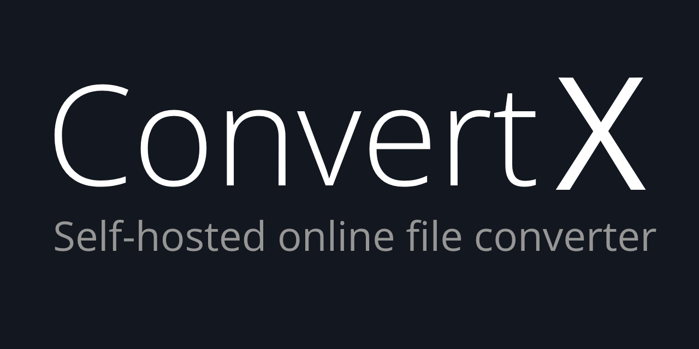
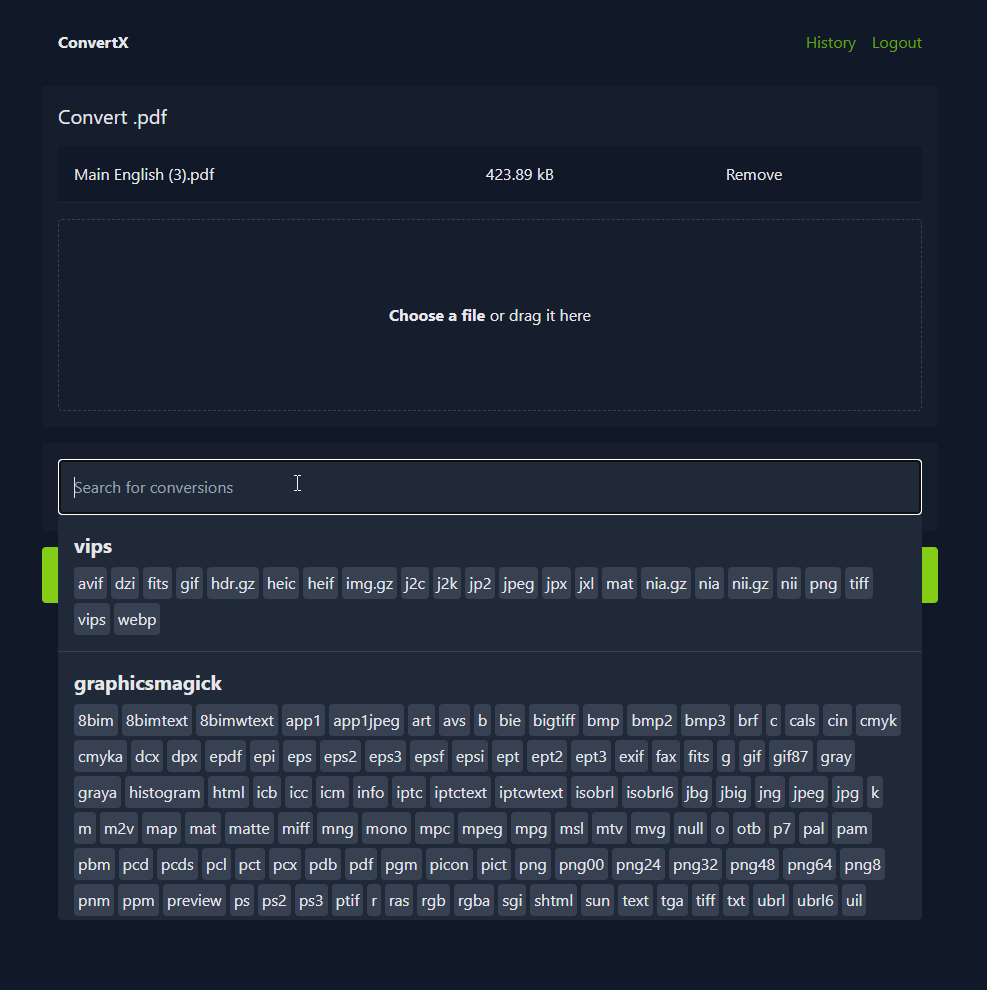

# ConvertX

[](https://github.com/C4illin/ConvertX/actions/workflows/docker-publish.yml)
[](https://github.com/C4illin/ConvertX/pkgs/container/ConvertX)
[](https://hub.docker.com/r/c4illin/convertx)
[](https://github.com/C4illin/ConvertX/pkgs/container/convertx)


<a href="https://trendshift.io/repositories/13818" target="_blank"></a>

<!--  -->

A self-hosted online file converter. Supports over a thousand different formats. Written with TypeScript, Bun and Elysia.

## Features

- Convert files to different formats
- Process multiple files at once
- Password protection
- Multiple accounts

## Converters supported

| Converter                                                       | Use case         | Converts from | Converts to |
| --------------------------------------------------------------- | ---------------- | ------------- | ----------- |
| [Inkscape](https://inkscape.org/)                               | Vector images    | 7             | 17          |
| [libjxl](https://github.com/libjxl/libjxl)                      | JPEG XL          | 11            | 11          |
| [resvg](https://github.com/RazrFalcon/resvg)                    | SVG              | 1             | 1           |
| [Vips](https://github.com/libvips/libvips)                      | Images           | 45            | 23          |
| [libheif](https://github.com/strukturag/libheif)                | HEIF             | 2             | 4           |
| [XeLaTeX](https://tug.org/xetex/)                               | LaTeX            | 1             | 1           |
| [Calibre](https://calibre-ebook.com/)                           | E-books          | 26            | 19          |
| [LibreOffice](https://www.libreoffice.org/)                     | Documents        | 41            | 22          |
| [Dasel](https://github.com/TomWright/dasel)                     | Data Files       | 5             | 4           |
| [Pandoc](https://pandoc.org/)                                   | Documents        | 43            | 65          |
| [msgconvert](https://github.com/mvz/email-outlook-message-perl) | Outlook          | 1             | 1           |
| VCF to CSV                                                      | Contacts         | 1             | 1           |
| [dvisvgm](https://dvisvgm.de/)                                  | Vector images    | 4             | 2           |
| [ImageMagick](https://imagemagick.org/)                         | Images           | 245           | 183         |
| [GraphicsMagick](http://www.graphicsmagick.org/)                | Images           | 167           | 130         |
| [Assimp](https://github.com/assimp/assimp)                      | 3D Assets        | 77            | 23          |
| [FFmpeg](https://ffmpeg.org/)                                   | Video            | ~472          | ~199        |
| [Potrace](https://potrace.sourceforge.net/)                     | Raster to vector | 4             | 11          |
| [VTracer](https://github.com/visioncortex/vtracer)              | Raster to vector | 8             | 1           |
| [Markitdown](https://github.com/microsoft/markitdown)           | Documents        | 6             | 1           |
| [pdftops](https://poppler.freedesktop.org/)                     | Documents        | 1             | 2           |

<!-- many ffmpeg fileformats are duplicates -->

Any missing converter? Open an issue or pull request!

## Deployment

> [!WARNING]
> If you can't login, make sure you are accessing the service over localhost or https otherwise set HTTP_ALLOWED=true

```yml
# docker-compose.yml
services:
  convertx:
    image: ghcr.io/c4illin/convertx
    container_name: convertx
    restart: unless-stopped
    ports:
      - "3000:3000"
    environment:
      - JWT_SECRET=aLongAndSecretStringUsedToSignTheJSONWebToken1234 # will use randomUUID() if unset
      # - HTTP_ALLOWED=true # uncomment this if accessing it over a non-https connection
    volumes:
      - ./data:/app/data
```

or

```bash
docker run -p 3000:3000 -v ./data:/app/data ghcr.io/c4illin/convertx
```

Then visit `http://localhost:3000` in your browser and create your account. Don't leave it unconfigured and open, as anyone can register the first account.

If you get unable to open database file run `chown -R $USER:$USER path` on the path you choose.

### Environment variables

All are optional, JWT_SECRET is recommended to be set.

| Name                         | Default                                            | Description                                                                                                                                                   |
| ---------------------------- | -------------------------------------------------- | ------------------------------------------------------------------------------------------------------------------------------------------------------------- |
| JWT_SECRET                   | when unset it will use the value from randomUUID() | A long and secret string used to sign the JSON Web Token                                                                                                      |
| ACCOUNT_REGISTRATION         | false                                              | Allow users to register accounts                                                                                                                              |
| HTTP_ALLOWED                 | false                                              | Allow HTTP connections, only set this to true locally                                                                                                         |
| ALLOW_UNAUTHENTICATED        | false                                              | Allow unauthenticated users to use the service, only set this to true locally                                                                                 |
| AUTO_DELETE_EVERY_N_HOURS    | 24                                                 | Checks every n hours for files older then n hours and deletes them, set to 0 to disable                                                                       |
| WEBROOT                      |                                                    | The address to the root path setting this to "/convert" will serve the website on "example.com/convert/"                                                      |
| FFMPEG_ARGS                  |                                                    | Arguments to pass to the input file of ffmpeg, e.g. `-hwaccel vaapi`. See https://github.com/C4illin/ConvertX/issues/190 for more info about hw-acceleration. |
| FFMPEG_OUTPUT_ARGS           |                                                    | Arguments to pass to the output of ffmpeg, e.g. `-preset veryfast`                                                                                            |
| HIDE_HISTORY                 | false                                              | Hide the history page                                                                                                                                         |
| LANGUAGE                     | en                                                 | Language to format date strings in, specified as a [BCP 47 language tag](https://en.wikipedia.org/wiki/IETF_language_tag)                                     |
| UNAUTHENTICATED_USER_SHARING | false                                              | Shares conversion history between all unauthenticated users                                                                                                   |
| MAX_CONVERT_PROCESS          | 0                                                  | Maximum number of concurrent conversion processes allowed. Set to 0 for unlimited.                                                                            |
| PORT                         | 3000                                               | Application listen port                                                                                                                                       |

### Docker images

There is a `:latest` tag that is updated with every release and a `:main` tag that is updated with every push to the main branch. `:latest` is recommended for normal use.

The image is available on [GitHub Container Registry](https://github.com/C4illin/ConvertX/pkgs/container/ConvertX) and [Docker Hub](https://hub.docker.com/r/c4illin/convertx).

| Image                                  | What it is                       |
| -------------------------------------- | -------------------------------- |
| `image: ghcr.io/c4illin/convertx`      | The latest release on ghcr       |
| `image: ghcr.io/c4illin/convertx:main` | The latest commit on ghcr        |
| `image: c4illin/convertx`              | The latest release on docker hub |
| `image: c4illin/convertx:main`         | The latest commit on docker hub  |


<!-- Dockerhub was introduced in 0.9.0 and older releases -->

### Tutorial

> [!NOTE]
> These are written by other people, and may be outdated, incorrect or wrong.

Tutorial in french: <https://belginux.com/installer-convertx-avec-docker/>

Tutorial in chinese: <https://xzllll.com/24092901/>

Tutorial in polish: <https://www.kreatywnyprogramista.pl/convertx-lokalny-konwerter-plikow>

## Screenshots



## Development

0. Install [Bun](https://bun.sh/) and Git
1. Clone the repository
2. `bun install`
3. `bun run dev`

Pull requests are welcome! See open issues for the list of todos. The ones tagged with "converter request" are quite easy. Help with docs and cleaning up in issues are also very welcome!

Use [conventional commits](https://www.conventionalcommits.org/en/v1.0.0/#summary) for commit messages.

## Contributors

<a href="https://github.com/C4illin/ConvertX/graphs/contributors">
  
</a>


## Star History

<a href="https://github.com/C4illin/ConvertX/stargazers">
 <picture>
   <source media="(prefers-color-scheme: dark)" srcset="https://api.star-history.com/svg?repos=C4illin/ConvertX&type=Date&theme=dark" />
   <source media="(prefers-color-scheme: light)" srcset="https://api.star-history.com/svg?repos=C4illin/ConvertX&type=Date" />
   
 </picture>
</a>


## 🌐 Web Resources & Interactive Index
- [CUBES CRUSHER](https://studylab-zh.pages.dev/cubes-crusher.html)
- [HUMAN LEAP EVOLUTION](https://skillquest-en.pages.dev/human-leap-evolution.html)
- [INDEX7](https://eduacademy-en.pages.dev/index7.html)
- [CATEGORY PUZZLE 7](https://studyquest-ja.pages.dev/category-puzzle-7.html)
- [CATEGORY PUZZLE 5](https://knowledgeclass-fr.pages.dev/category-puzzle-5.html)
- [CATEGORY RACING DRIVING 2](https://eduplay-es.pages.dev/category-racing-driving-2.html)
- [COOKIE LAND](https://learnquest-ru.pages.dev/cookie-land.html)
- [PUSH TO GO](https://lessonplay-fr.pages.dev/push-to-go.html)
- [DEEP FISHING](https://edulab-en.pages.dev/deep-fishing.html)
- [CONNECT PUZZLE IMAGE](https://schoolgames-es.pages.dev/connect-puzzle-image.html)
- [WORMSARENAIO](https://skillworld-hi.pages.dev/wormsarenaio.html)
- [DRUNK BUT NOT WASTED KNIGHT](https://studyarcade-vi.pages.dev/drunk-but-not-wasted-knight.html)
- [INDEX11](https://eduplay-es.pages.dev/index11.html)
- [LOVE ARCHER](https://learnworld-pt.pages.dev/love-archer.html)
- [INDEX15](https://eduplay-es.pages.dev/index15.html)
- [ZOMBIE RODEO MULTIPLICATION](https://brainquestses.pages.dev/zombie-rodeo-multiplication.html)
- [BLOCKPUZZLE COLOR BLAST](https://themindfactorys.pages.dev/blockpuzzle-color-blast.html)
- [LOVE COLORS](https://mindgames-hi.pages.dev/love-colors.html)
- [CHICKEN BANANA RUN](https://studyclass-hi.pages.dev/chicken-banana-run.html)
- [MONSTER SCHOOL 2](https://brainquestsfr.pages.dev/monster-school-2.html)
- [CATEGORY PLATFORM260](https://knowledgelab-fr.pages.dev/category-platform260.html)
- [RANCH ADVENTURES](https://quizzesarena.onrender.com/ranch-adventures.html)
- [PUMPKIN CATCHER](https://quizzesarena.onrender.com/pumpkin-catcher.html)
- [CATEGORY MERGE 2](https://brainquestspt.pages.dev/category-merge-2.html)
- [RAGDOLL ARENA 2 PLAYER](https://studyworld-fr.pages.dev/ragdoll-arena-2-player.html)
- [CAR DESTRUCTION KING](https://eduquest-ko.pages.dev/car-destruction-king.html)
- [PANDA ADVENTURE](https://mindconvertfr.pages.dev/panda-adventure.html)
- [MOTO ATTACK BIKE RACING](https://brainquestsfr.pages.dev/moto-attack-bike-racing.html)
- [TURBO RACE](https://quizzesarena.onrender.com/turbo-race.html)
- [CATEGORY DEEP IMMERSIVE24](https://classgames-pt.pages.dev/category-deep-immersive24.html)
- [CATEGORY BASKETBALL 2](https://learnclass-zh.pages.dev/category-basketball-2.html)
- [SKYDOM REFORGED](https://brainquest-hi.pages.dev/skydom-reforged.html)
- [BALL EATING SIMULATOR](https://studyworld-fr.pages.dev/ball-eating-simulator.html)
- [POCKET CAR MASTER](https://learninglab-hi.pages.dev/pocket-car-master.html)
- [TERRA CRAFT WORLD](https://mindconvertjp.pages.dev/terra-craft-world.html)
- [QUIZ X](https://gameclass-ja.pages.dev/quiz-x.html)
- [CATEGORY DESTROY254](https://studyworld-fr.pages.dev/category-destroy254.html)
- [CATEGORY BIKE 2](https://studyquest-ja.pages.dev/category-bike-2.html)
- [ANIMATION COLORING ALPHABET LORE](https://lessonquest-ru.pages.dev/animation-coloring-alphabet-lore.html)
- [KIOMET COM](https://studyclass-hi.pages.dev/kiomet-com.html)
- [CARS VS ZOMBIES](https://quizzesarena.onrender.com/cars-vs-zombies.html)
- [CHROMA TREK](https://learnquest-ru.pages.dev/chroma-trek.html)
- [RIFT OF HELL DEMONS WAR](https://learnworld-pt.pages.dev/rift-of-hell-demons-war.html)
- [CATEGORY PUZZLE 5](https://quizzesarena.onrender.com/category-puzzle-5.html)
- [GOOSE CUP](https://brainquestspt.pages.dev/goose-cup.html)
- [CARTOON MOTO STUNT](https://learninggames-fr.pages.dev/cartoon-moto-stunt.html)
- [SNAKES](https://lessonquest-ru.pages.dev/snakes.html)
- [SQUID GAME HUNTER](https://brainquestsfr.pages.dev/squid-game-hunter.html)
- [LUDO WORLD](https://mindconvertes.pages.dev/ludo-world.html)
- [BACKROOMS](https://brainquestsfr.pages.dev/backrooms.html)
- [THE SUPERHERO LEAGUE](https://thestudyarcades9.pages.dev/the-superhero-league.html)
- [HOTFOOT BASEBALL](https://quizzesarena.web.app/hotfoot-baseball.html)
- [FIRESIDE SOLITAIRE](https://studyworld-fr.pages.dev/fireside-solitaire.html)
- [CATEGORY BIKE](https://theeduquests-ko.pages.dev/category-bike.html)
- [VEX X3M](https://quizzesarena.onrender.com/vex-x3m.html)
- [BLOCK BLAST 2048](https://quizzesarena.onrender.com/block-blast-2048.html)
- [TRAFFIC RUN PUZZLE](https://lessonquest-ru.pages.dev/traffic-run-puzzle.html)
- [OBBY ON A BIKE](https://theeduquests-ko.pages.dev/obby-on-a-bike.html)
- [HILL STATION BUS SIMULATOR](https://quizzesarena.onrender.com/hill-station-bus-simulator.html)
- [ASMR TATTOO TREATMENT](https://mindconvert.onrender.com/asmr-tattoo-treatment.html)
- [INDEX11](https://brainquesteses.pages.dev/index11.html)
- [HIDDEN OBJECT MY HOTEL](https://eduquest-ko.pages.dev/hidden-object-my-hotel.html)
- [BRIDGE WARS](https://gameclass-ja.pages.dev/bridge-wars.html)
- [TOWER DEFENSE DRAGON MERGE](https://mindconvertes.pages.dev/tower-defense-dragon-merge.html)
- [CATEGORY TOWER DEFENSE](https://mindconvertes.pages.dev/category-tower-defense.html)
- [CATEGORY SECURLY BYPASS](https://thestudyarcades-vi.pages.dev/category-securly-bypass.html)
- [LOVE IN STYLE](https://eduquest-ko.pages.dev/love-in-style.html)
- [WINTER WOLF](https://themindinstitutes.pages.dev/winter-wolf.html)
- [ELEMENTAL MONSTERS MERGE EVOLUTION](https://studyworld-fr.pages.dev/elemental-monsters-merge-evolution.html)
- [BEACH CLUB](https://mindconvertes.pages.dev/beach-club.html)
- [HEAT INCREMENTAL](https://thebrainquests-hi.pages.dev/heat-incremental.html)
- [CATEGORY STRATEGY](https://studyworld-fr.pages.dev/category-strategy.html)
- [BOMBAMAN 3D](https://learnworld-pt.pages.dev/bombaman-3d.html)
- [DRIVERZ ED](https://brainquestspt.pages.dev/driverz-ed.html)
- [FOOD TOWER DEFENSE](https://thestudyarcades9.pages.dev/food-tower-defense.html)
- [GLACIER RUSH](https://thestudyarcades9.pages.dev/glacier-rush.html)
- [SNAKE KING](https://theeduplays-es.pages.dev/snake-king.html)
- [ZOMBIE EEASTER BUNNIES](https://thestudyarcades9.pages.dev/zombie-eeaster-bunnies.html)
- [HARD PUZZLE](https://quizzesarena.onrender.com/hard-puzzle.html)
- [ROAD CHASE SHOOTER REALISTIC GUNS](https://gameclass-ja.pages.dev/road-chase-shooter-realistic-guns.html)
- [COIN COLOR SORT](https://smartlab-ru.pages.dev/coin-color-sort.html)
- [CATEGORY ESCAPE](https://quizzesarena.web.app/category-escape.html)
- [DREAM KITCHEN](https://theeduquests-ko.pages.dev/dream-kitchen.html)
- [TERMS](https://themindconvert.web.app/terms.html)
- [NINJA CLIMB](https://brainquest-hi.pages.dev/ninja-climb.html)
- [BR BR PATAPIM OBBY CHALLENGE](https://gameclass-ja.pages.dev/br-br-patapim-obby-challenge.html)
- [AGE OF ZOMBIES](https://theeduquests-ko.pages.dev/age-of-zombies.html)
- [FIND OBJECTS HIDDEN ITEM](https://chuyentestss.pages.dev/find-objects-hidden-item.html)
- [EASTER STYLE JUNCTION EGG HUNT EXTRAVAGANZA](https://quizzesarena.onrender.com/easter-style-junction-egg-hunt-extravaganza.html)
- [CAKE LINK MASTER](https://smartlab-ru.pages.dev/cake-link-master.html)
- [LAZY WORKERS](https://eduquest-ko.pages.dev/lazy-workers.html)
- [PUZZLE WOOD BLOCK](https://studyclass-hi.pages.dev/puzzle-wood-block.html)
- [CATEGORY SOCCER](https://studyworld-fr.pages.dev/category-soccer.html)
- [KITCHEN STAR](https://studyworld-fr.pages.dev/kitchen-star.html)
- [BACTERIA LIFE DEATH](https://quizzesarena.onrender.com/bacteria-life-death.html)
- [WOOD NUTS MASTER SCREW PUZZLE](https://learnquest-ru.pages.dev/wood-nuts-master-screw-puzzle.html)
- [MY PET CARE SALON](https://brainquesteses.pages.dev/my-pet-care-salon.html)
- [EVERYTHING IS IN PLACE RARE FINDS](https://studyworld-fr.pages.dev/everything-is-in-place-rare-finds.html)
- [CATEGORY MAHJONG CONNECT](https://chuyentestss.pages.dev/category-mahjong-connect.html)
- [TAP OUT PUZZLE](https://studyclass-hi.pages.dev/tap-out-puzzle.html)
- [DOMINO WORLD](https://theeduplays9.pages.dev/domino-world.html)
- [CATEGORY FARMING87](https://theeduquests-ko.pages.dev/category-farming87.html)
- [ALIEN HUNTERS](https://edugames-ja.pages.dev/alien-hunters.html)
- [CODE MAZE](https://themindfactorys.pages.dev/code-maze.html)
- [CATEGORY OBBY56](https://brainquestspt.pages.dev/category-obby56.html)
- [INDEX31](https://brainquestspt.pages.dev/index31.html)
- [PORTALS](https://eduquestsjp.pages.dev/portals.html)
- [FRUIT NINJA](https://quizzesarena.web.app/fruit-ninja.html)
- [CATEGORY BOOKMARKLET](https://mindconvert.onrender.com/category-bookmarklet.html)
- [FARM ANIMAL SORT PUZZLE](https://gameclass-ja.pages.dev/farm-animal-sort-puzzle.html)
- [CRAFTMART](https://theeduquests-ko.pages.dev/craftmart.html)
- [CATEGORY MANAGEMENT GAME](https://learnclass-zh.pages.dev/category-management-game.html)
- [FASHION BATTLE FOR SURVIVAL](https://lessonquest-ru.pages.dev/fashion-battle-for-survival.html)
- [CATEGORY DIRT BIKE](https://learnclass-zh.pages.dev/category-dirt-bike.html)
- [TIMBERLAND ARRANGE PUZZLE GAME](https://gamelearning-pt.pages.dev/timberland-arrange-puzzle-game.html)
- [CATEGORY THINKY 2](https://lessonquest-ru.pages.dev/category-thinky-2.html)
- [COFFEE CRAZE SORTING GAME](https://themindquests-zh.pages.dev/coffee-craze-sorting-game.html)
- [CATEGORY CASUAL](https://thelearnplays-pt.pages.dev/category-casual.html)
- [BATTLER](https://studygames-ru.pages.dev/battler.html)
- [SWORD AND SPIN](https://eduquestsjp.pages.dev/sword-and-spin.html)
- [EASTER EGGVENTURE](https://themindfactorys.pages.dev/easter-eggventure.html)
- [COLOR NUTS BOLTS PUZZLE](https://quizzesarena.onrender.com/color-nuts-bolts-puzzle.html)
- [FAMILY TREE EMOJI](https://thelearningarcades.pages.dev/family-tree-emoji.html)
- [CATEGORY PHYSICS371](https://lessonlab-ko.pages.dev/category-physics371.html)
- [GT CHAMPIONSHIP ARCADE](https://learnworld-pt.pages.dev/gt-championship-arcade.html)
- [SOKOBAN PUZZLE GAME](https://themindinstitutes.pages.dev/sokoban-puzzle-game.html)
- [CATEGORY FOOTBALL](https://theeduquests-ko.pages.dev/category-football.html)
- [CAKE SORT](https://skillquest-en.pages.dev/cake-sort.html)
- [THE BIG HIT RUN](https://skillquest-en.pages.dev/the-big-hit-run.html)
- [TREASURE HUNT PUZZLE](https://themindconvert.web.app/treasure-hunt-puzzle.html)
